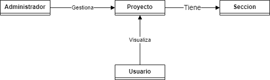

# Acerca de

Pagina web personal con el proposito de servir de presentacion como desarrollador e ingeniero de sistemas.

## Pasos o tareas por hacer

1.  Plantear la estructura de clases de la pagina mediante diagramas UML.
2.  Afianzar el uso de MarkDown para agregar las imagenes de los diferentes diagramas.
3.  Evaluar la necesidad del uso de testing en el proceso de desarrollo para un proyecto relativamente simple.
4.  Evaluar las opciones de despliegue, como usar github page, pythonanywhere, la compra de un dominio, o diferentes proveedores de nube como GCP o Microsoft Azure
5.  Crear una rutina de desarrollo que lleve a culminacion este importante proyecto personal.
6.  Diseñar un boceto del FrontEnd, sencillo, limpio, con tematica apropiada, resposive, y que presente los diferentes proyectos(futuros momentaneamente).

## Tecnologias y lenguajes usados

- Django y Python para la implementacion del portafolio.
- Diagramas UML para diseñar la estructura y funcionamiento de la pagina.

## Objetivos especificos

- Presentar proyectos personales desarrollados o en proceso.
- Ser puente de presentacion profesional para posibles empleos.
- Ser puente de acceso a proyectos de desarrollo personales.
- Ayudar a afianzar conocimientos obtenidos.
- Ser el primer paso en una disciplina mayor en diseño, desarrollo, prueba y despliegue de aplicaciones web.

## Documentacion de diseño

![Prueba imagen mediante link](https://viewer.diagrams.net/?tags=%7B%7D&highlight=0000ff&edit=_blank&layers=1&nav=1&title=DiagramasDePortafolio.drawio#R7Vpdc6M2FP01nmkf0jFgSPIYnGT3IdtJNrvtdN9kuAY1QqJCju38%2Bl6BZIIxXjdZL%2B4MM54xurr6uufo6vAx8qbZ6oMkefpJxMBG7jhejbzrkes6Y3%2BMf9qyriy%2BZwyJpLFxqg2P9AVsS2Nd0BiKhqMSgimaN42R4Bwi1bARKcWy6TYXrDlqThJoGR4jwtrWP2ms0sp64Z7X9o9Ak9SO7ASXVU1GrLNZSZGSWCxfmbybkTeVQqjqKltNgeng2bhU7W47ajcTk8DVIQ2%2BXWR%2F%2FT77%2BvDtIX%2BYrGfXKzeen9lunglbmBWP3IBhh%2BFcYL84bbU2sQj%2BWQhbcVaUSF2hgzPJEe2wrserRP9%2FocDB9obzqjqs6kxINn27EGPYTVFIlYpEcMJuamsoxYLHoBczxlLtcydEjkYHjX%2BDUmvDIbJQAk2pypipBR5faUZgccZE9FSZbimzDtWk9Ew6Q2xMhVjICPbE1VKVyATUPr%2FzDRNwC4HIQMk1NpTAiKLPzYkQw%2BVk41fDjRcG8f%2BAfhv8eynWuI1EC59iSTNGOBj8LVQ6bITRhON1hFECiYZnkIriFroyFUoDFEYpZfEdWYuFDkihSPRkS2EqJH3BbomFAqulMki6QcPjUbc0LJCgeXhvAXK2TJ%2FIquF4RwplDJFgjOQFnW2WkSFWlIdCKZEZp2VKFTzmpIR6iQmuSSgTPVwtrEbNZFR2Dt1b1dkNu%2BnGs0nSJE1nYsrLOgU5Y2NLX6Uf224XU8xonxFewhNcdj2cM2kON94xXLBjuIugORxhSABOFIR6rxYtfm5W%2BnbKujvyVagTOwWd2XVCUuscWvxFiFTJKymeYCqYQKJec1ERGlPAlslymsFcdTK6QGZQntyVPteT2vLZhEibBLadszLrpDSOgZepTBFFKuppnuWCclXG0A%2Fxh5Gejn%2FzRz5OfIplpy7jT7tLNRUc10JoSShAXi9Bc%2FvNlH1Nzu5c0WasoYwbHMYYN%2Bgm6LtSmbeDF1sUYLSEtqKAPcydN%2BGfIZLloWQA%2F1IeQWdOixRemxTeDgIwMgN2LwqqqND9y8p3ixjfw75JbspTkFQdEXTfPTBNHAnzSUcuwN5TEf%2Bi88CvQ0roKyUEBx4iR0sJbvus%2BIARwR1G3iA%2FUb7nutbcaGhmvF%2BSlvs%2BRD2TlF1ZxsUwJwvWJmdt%2F67m2mQordZuSUaZhuUjsGfQflbGVRNzHFNuD%2FQzRbN%2FqGjuUzP7LVJdxRnlVG%2B9GIM3COcehfNGuQ7CeZu3wSCc%2Bzkl%2FdMWzueDcD6CcN4Pet%2FC%2BWIQziecEvoXzu2b6T9osUAcXwblfJLK%2BfL%2FoJwvW6z6iqSSdHjYfFIPm93zQTPb7TIeRHM%2FJ%2BTlaYtmZ9dr00E1v1c170e9b9XsdL17GmTzKSSF3mWz076VfoQo0ltsEDg9Chx%2FMjwU7KJs15OAQeAc%2B91Zx4c%2FJ6Nw2ndrg8L5AS%2FU98Pet8Rxu254BolzEmnhiBoHi%2FW3qNX5Un%2FR6938Cw%3D%3D)
